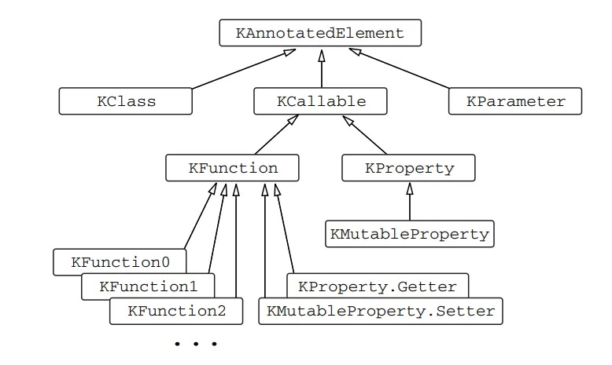

# Kotlin cheatsheet

## Basic

* Basic Types

  * Integer: `Byte`, `Short`, `Int`, `Long`, `Float`, `Double`

  

* Triple-quoted strings

  ```kotlin
  val tripleQuotedString = """
      #question = foo
      #answer = bar""".trimMargin("#")
  
  // don't need to escape a backslash with a backslash
  val month = "(JAN|FEB|MAR|APR|MAY|JUN|JUL|AUG|SEP|OCT|NOV|DEC)"
  fun getPattern(): String = """\d{2}\s$month\s\d{4}"""
  ```

* Nothing type

  ```kotlin
  fun willThrow(age: Int?): Nothing {
      throw IllegalArgumentException("Wrong age: $age")
  }
  ```

* Operator overloading

  ```kotlin
  data class MyDate(val year: Int, val month: Int, val dayOfMonth: Int) : Comparable<MyDate> {
      override operator fun compareTo(other: MyDate): Int = when {
          year != other.year -> year - other.year
          month != other.month -> month - other.month
          else -> dayOfMonth - other.dayOfMonth
      }
  }
  
  fun test(date1: MyDate, date2: MyDate) {
      // this code should compile:
      println(date1 < date2)
  }
  ```

* extension

  ```kotlin
  fun <R> (() -> R).memoize(): () -> R {
      var cached: R? = null
  
      return {
          cached ?: this().apply { cached = this }
      }
  }
  
  fun expensiveCompute(): Int {
      println("doing some calculation...")
      Thread.sleep(3000)
      return 42
  }
  
  infix fun <T> T?.shouldBe(expected: T?) = assert(this == expected)
  
  fun main() {
      val memoizedFunc = ::expensiveCompute.memoize()
      println(memoizedFunc())
      println(memoizedFunc())
      
      obj.value shouldBe "foo"
  }
  ```

* Lambda with receiver

  ```kotlin
  inline fun <T> T.apply(block: T.() -> Unit): T {
      this.block()
      return this
  }
  ```


## Interface

TODO

## Generic

* out: declaration-site variance

  ```kotlin
  fun <T, C : MutableCollection<in T>> Iterable<T>.filterTo(dest: C, predicate: (T) -> Boolean): C {
      for (element in this) {
          if (predicate(element)) {
              dest.add(element)
          }
      }
      return dest
  }
  ```

  

## Reflection

[Mastering Kotlin Reflection](https://medium.com/@amoljp19/mastering-kotlin-reflection-bce2a561a467)

In Kotlin, there are two reflection APIs you can work with. 

1. standard Java reflection API `java.lang.reflect` which works perfectly with Kotlin.

   ```kotlin
   data class Person(val name: String, val age: Int)
   
   fun main() {
       val person = Person("Alice", 25)
       val properties = person.javaClass.declaredFields
   
       for (property in properties) {
           property.isAccessible = true
           val value = property.get(person)
           println("${property.name}: $value")
       }
   }
   ```

   

2. Kotlin reflection API, defined in the kotlin.reflect package. It provides access to concepts that don't exist in the Java world, such as properties and nullable types.

   To use kotlin reflection, add `kotlin-reflect` artifact as a dependency.

   ```kotlin
   dependencies {
       implementation "org.jetbrains.kotlin:kotlin-reflect:1.9.0"
   }
   ```

   ```kotlin
   data class Person(
       val name: String,
       val age: Int
   )
   
   fun main() {
       val person = Person("Jack", 10)
       
       // Serialization using reflection
       val serializedData = person::class.memberProperties
           .associateBy({ it.name }, { it.get(person) })
       
       println(serializedData) // Output: {name=Jack, age=10}
       
       // Deserialization using reflection
       val deserializedPerson = person::class.constructors.first()
           .call(serializedData["name"], serializedData["age"])
       
       println(deserializedPerson) // Output: Person(name=Jack, age=10)
   }
   ```

   

## Annotations

Learn more about: https://kotlinlang.org/docs/annotations.html

```kotlin
@Target(AnnotationTarget.FUNCTION)
@Retention(AnnotationRetention.RUNTIME)
annotation class Router(val url: String, val method: String = "GET")

class App {
    @Router(url = "/")
    fun index(): String = "hello world"
}

fun main() {
    for (fn in App::class.functions) {
        for (anno in fn.annotations) {
            if (anno is Router) {
                println("name: ${fn.name}, url: ${anno.url}, method: ${anno.method}")
            }
        }
    }
}
```

## This

To denote the current **receiver**, use this expressions:

* In a member of a class, `this` refers to the current object of that class.
* In an extension function or a function literal with receiver `this` denotes the **receiver** parameter that is passed on the left-hand side of a dot.

If `this` has no qualifiers, it refers to the **innermost enclosing scope**. To refer to this in other scopes, **label qualifiers** are used:

```kotlin
class A { // implicit label @A
    inner class B { // implicit label @B
        fun Int.foo() { // implicit label @foo
            val a = this@A // A's this
            val b = this@B // B's this

            val c = this // foo()'s receiver, an Int
            val c1 = this@foo // foo()'s receiver, an Int

            val funLit = lambda@ fun String.() {
                val d = this // funLit's receiver, a String
            }

            val funLit2 = { s: String ->
                // foo()'s receiver, since enclosing lambda expression
                // doesn't have any receiver
                val d1 = this
            }
        }
    }
}


```

## Misc

* JVM name

  ```kotlin
  @JvmName("filterValidString")
  fun List<String>.filterValid(): List<String> {
      TODO()
  }
  
  @JvmName("filterValidInt")
  fun List<Int>.filterValid(): List<Int> {
      TODO()
  }
  
  @get:JvmName("x")
  @set:JvmName("changeX")
  var x = 23
  
  public static void testJvmNameOnProperty() {
      SomeFileKt.changeX(111);
      SomeFileKt.x();
  }
  ```
  
  

## Standard library

TODO

## Calling Java from Kotlin

TODO

## Calling Kotlin from Java

TODO 

## Some Examples

```kotlin
import java.util.concurrent.atomic.AtomicInteger

enum class Level {
    INFO, WARNING, ERROR, FATAL,
}

data class Issue(
    var id: Int? = null,
    val title: String,
    val project: String,
    val level: Level,
) {
    init {
        if (id == null) {
            id = counter.getAndIncrement()
        }
    }

    private companion object {
        var counter: AtomicInteger = AtomicInteger(1)
    }
}

class IssuePredicate(private val project: String) : (Issue) -> Boolean {
    override fun invoke(issue: Issue) = this.project == issue.project && issue.isImportant()

    // NOTE: extension func can be defined in a class
    private fun Issue.isImportant(): Boolean {
        println("project is $project")
        return this.level == Level.ERROR || this.level == Level.FATAL
    }
}

fun main() {
    val issues = listOf(
        Issue(title = "hello world", project = "foo", level = Level.FATAL),
        Issue(title = "hello java", project = "bar", level = Level.ERROR),
        Issue(title = "hello kotlin", project = "foo", level = Level.FATAL),
        Issue(title = "hello rust", project = "bar", level = Level.INFO),
    )
    val predicate = IssuePredicate("bar")
    val result = issues.filter(predicate)
    println(result)
}
```

[Object updater pattern in Kotlin](http://tuhrig.de/object-updater-pattern-in-kotlin/)

```kotlin
import kotlin.reflect.KMutableProperty0
import kotlin.reflect.jvm.isAccessible

fun main() {
    val p = Product("foo", 1)
    Updater()
        .update(p::name).to("bar")
        .update(p::price).to(2)
        .execute()
    println(p)
}

data class Product(var name: String, var price: Int)

class Updater {
    private val updatesToExecute = mutableListOf<Update>()

    fun update(field: KMutableProperty0<*>): Update {
        val updateToExecute = Update(this, field)
        updatesToExecute.add(updateToExecute)
        return updateToExecute
    }

    fun execute() = updatesToExecute.map(Update::execute).any { it }

    class Update(
        private val updater: Updater,
        private val field: KMutableProperty0<*>
    ) {
        private var newValue: Any? = null

        fun to(newValue: Any?): Updater {
            this.newValue = newValue
            return updater
        }

        fun execute(): Boolean {
            return if (newValue != null && field.get() != newValue) {
                field.isAccessible = true
                field.setter.call(newValue)
                true
            } else false
        }
    }
}
```

